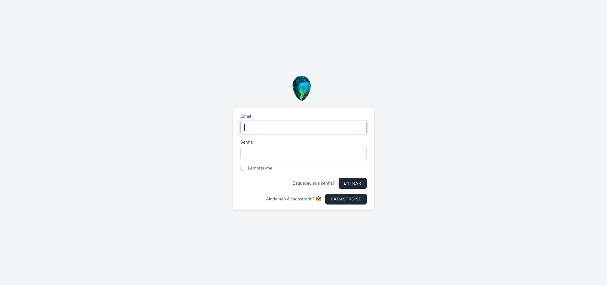

<div align="center" id="top"> 
  <!--  -->

  &#xa0;

  <!-- <a href="https://beacademydevstarturmalina.netlify.app">Demo</a> -->
</div>

<h1 align="center">Be Academy Devstart Turmalina</h1>

<a href="https://turmalina-devstart.herokuapp.com/">

</a>

<p align="center">
  

  

  

  

  

  

  
</p>

<h4 align="center"> 
	🚧 em construção...  🚧
</h4> 

<p align="center">
  <a href="#dart-sobre">Sobre</a> &#xa0; | &#xa0; 
  <a href="#sparkles-features">Features</a> &#xa0; | &#xa0;
  <a href="#rocket-tecnologias">Tecnologias</a> &#xa0; | &#xa0;
  <a href="#white_check_mark-requisitos">Requisitos</a> &#xa0; | &#xa0;
  <a href="#checkered_flag-executar">Executar</a> &#xa0; | &#xa0;
  <a href="#memo-license">License</a> &#xa0; | &#xa0;
  <a href="#memo-desenvolvedores" target="_blank">Author</a>
</p>

<br>

## :dart: Sobre ##

Projeto Devstart Be Academy, squad turmalina.

E-commerce Turmalina.

## :sparkles: Features ##

:heavy_check_mark: Banco de dados Mysql;\
:heavy_check_mark: Cadastro de Produtos;\
:heavy_check_mark: Cadastro de Pedidos;\
:heavy_check_mark: API PayLivre;\
:heavy_check_mark: Testes unitários para regras de negócio;\
:heavy_check_mark: Checkout;

[Regras do projeto](./check-list.md)

## :rocket: Tecnologias ##

Tecnologias usadas no projeto

- [PHP](https://www.php.net/)
- [Laravel](https://laravel.com/)
- [Mysql](https://www.mysql.com/)
- [Breeze](https://github.com/laravel/breeze)
- [Tailwind UI](https://tailwindui.com/documentation)
- [validator-docs](https://github.com/geekcom/validator-docs)

## :white_check_mark: Requisitos ##

Para executar este projeto é importante ter instalado [Git](https://git-scm.com) e [PHP](https://www.php.net/).

## :checkered_flag: Executar ##

```bash
# Clone do projeto
git clone https://github.com/FariasMi/beacademy-devstart-turmalina

# Acessando o projeto
cd beacademy-devstart-turmalina/projeto-empresarial

# instalar dependencias
composer install
# ------------------
npm i

# criar tabelas
php artisan migrate

# executar projeto
npm run dev
# ------------------
php artisan serve

# ver o projeto rodando
# access http://localhost:8000

# criar usuario admin
# - crie um usuario comum
# - abra seu SGBD acesse o projeto 
# - abra a tabela de users e mude o campo is_admin para 1

```

## :memo: License ##

Este projeto esta sobre esta [LICENSE](LICENSE.md).

## :memo: Desenvolvedores ##
[Alexandre,](https://github.com/Alexandre-A11) <br>
[Douglas,](https://github.com/DouglasReiz) <br>
[Leandro Cavalcante,](https://github.com/LeoScripts) <br>

&#xa0;

<a href="#top">Voltar ao top</a>
